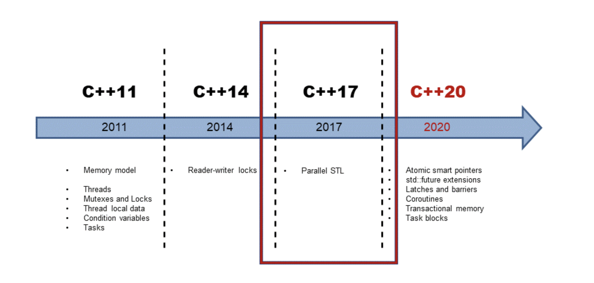

## concurrency 
  A coding technique that ensures the use of all cores and maximizes a machine’s capabilities.

## Concurrency vs. parallelism
In parallelism, we run multiple copies of the same program simultaneously, but they are executed on **different data**. These tasks are not necessarily in communication with each other, but they are running at the same time in parallel. 

Concurrent programming involves a shared memory location, and the different threads actually "read" the information provided by the previous threads.