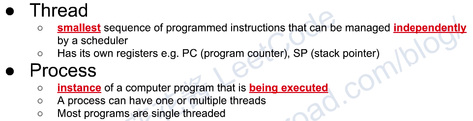
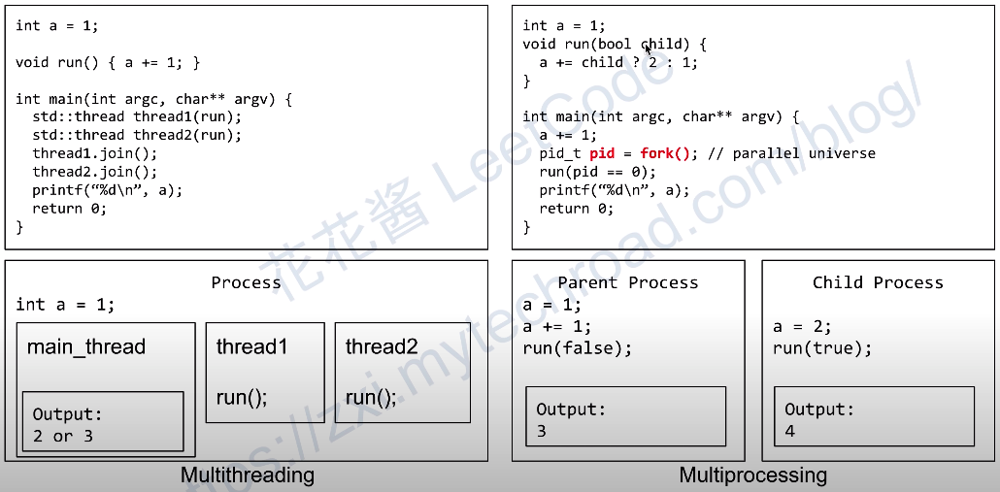
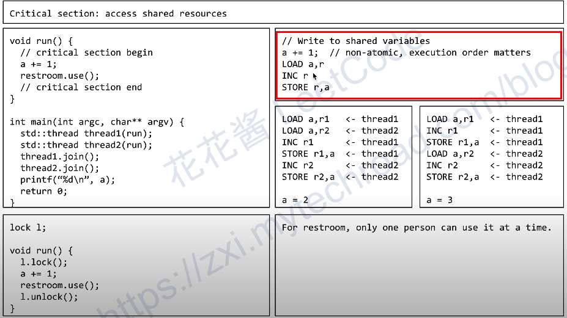
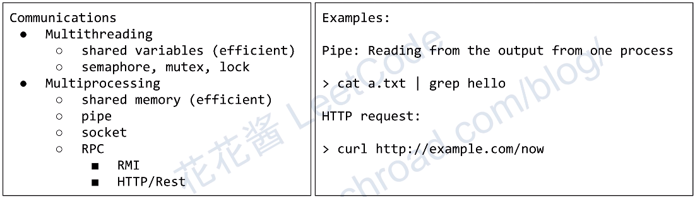

# 花花 线程与进程
## Reference
花花酱 线程与进程 并行计算1 - CS大讲堂 EP1
https://www.youtube.com/watch?v=prFEyaUEAMM

## Thread and Process

## Sample

## Critical section issue and lock

原因在于 变量会被读入寄存器再计算

## Communicatons

